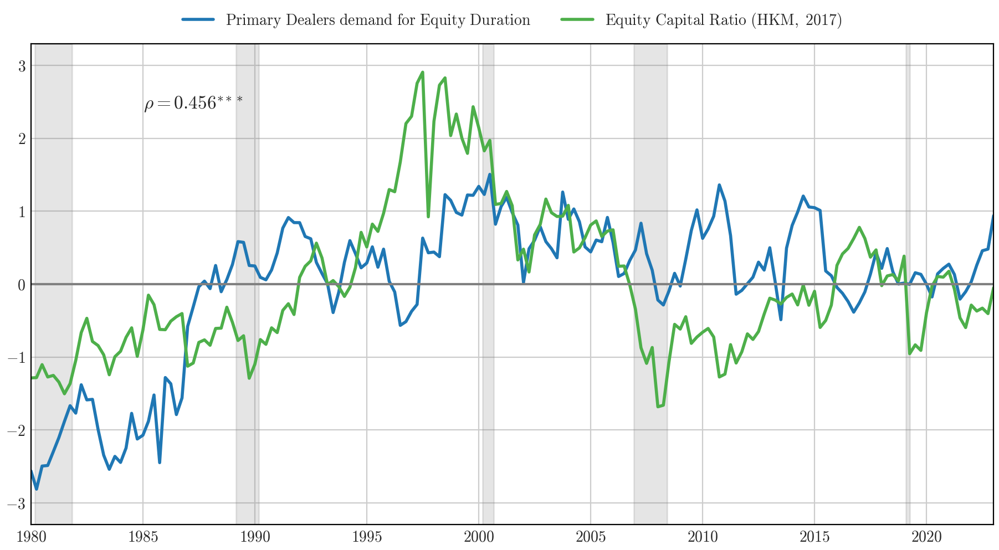

Working Papers
==============
---

<!---

  **1. Asset (and Data) Managers**

-->

  <strong>1. Asset (and Data) Managers</strong>
  Job Market Paper

*Recipient of the Inquire Europe 2025 Research Prize*\
*WFA Brattle Group Ph.D. Candidate Award*\
*INVERCO Best Paper in Asset Management at 32nd Finance Forum*\
*Best Ph.D. Student Paper at the 7th FutFinInfo Conference*\
*FMARC Best Ph.D. Student Paper*\
  <a href="#/" onclick="visib('MFData_Econ')">Abstract</a> 

This paper studies the direct impact of new technologies on the asset management industry.  
I show that technological innovations substantially improve fund managers’ ability to target customer demand and attract capital inflows, with implications for the industry’s structure.
Exploiting information from their websites’ codes, I track when fund managers start collecting and analyzing customers’ data using tools like Google Analytics.  
Funds adopting such technologies attract 1.5% higher annual flows, with the effect being concentrated in retail share classes. Additionally, they expand product offerings and charge higher fees. The effects decrease with competition as more funds within the same category adopt similar technologies.   
Overall, these results show that technological innovation in asset management extends beyond portfolio allocation decisions to impact how funds attract and retain capital. 
This evidence highlights the economic importance of managers learning from investors’ data.
 

  

**2. Financial Intermediaries and Demand for Duration**\
   with [Andrea Tamoni](https://www.andreatamoni.com/) and [Alberto Plazzi](https://sites.google.com/site/albertoplazzihome/home)\
This version: August 2025\
  <a href="#/" onclick="visib('Fin_DemandDur')">Abstract</a> \[[SSRN](https://papers.ssrn.com/sol3/papers.cfm?abstract_id=4605046)\] \[[PDF](../files/Financial_Intermediaries_and_Demand_for_Duration.pdf)\]

Stocks with long-term cash flows earn lower expected returns because they hedge fluctuations in investment opportunities. We study the role of financial institutions in shaping this duration premium using equity holdings of primary dealers, pension funds, banks, and insurance companies. We find that intermediaries’ demand for equity duration varies systematically with their risk-bearing capacity. In the time series, institutions reduce their demand for long-duration claims and increase their exposure to reinvestment risk when aggregate capital ratios are low. Such a result extends cross-sectionally: better-capitalized and better-performing institutions tilt their portfolios more strongly toward long-duration stocks than their constrained peers. These patterns align with an ICAPM framework in which hedging demand declines with risk aversion. Counterfactual exercises show that shifts in intermediaries’ preferences generate monotonic changes in expected returns across duration deciles, with especially large effects when demand shocks operate at the holding-company level.
    

  

**3. Are New Technologies Replacing the Information Produced by Financial Markets?**\
   with [Laurent Frésard](https://sites.google.com/view/laurentfresard/home)

<!---

## Working paper

Financial Intermediaries and Demand for Duration  [SSRN](https://papers.ssrn.com/sol3/papers.cfm?abstract_id=4605046)  
*with <a href="https://www.andreatamoni.com" target="_blank" style="text-decoration: none; color: inherit;">Andrea Tamoni</a>, and <a href="https://sites.google.com/site/albertoplazzihome/home" target="_blank" style="text-decoration: none; color: inherit;">Alberto Plazzi</a>*  
 Main presentations: SFI Research Days; 4th LTI@UniTO/Bank of Italy Workshop on Long-Term Investors; MFA; SGF Conference; 7th WSIR; 1st IFEA Conference 

  
Abstract

  

We investigate intermediaries demand for long-term cash flows by estimating a characteristic-based demand system on the equity holdings of primary dealers, pension funds, banks, and insurance companies. 
Institutions’ demand for equity duration varies over time and in the cross-section as a function of measures of capital availability. 
In the time-series, when financial constraints are tight, institutions curtail their demand for long-term claims and become more exposed to reinvestment risk. 
In the cross section, unconstrained institutions tilt their portfolio more strongly toward long-duration stocks compared to their constrained peers. 
We conclude that institutional constraints impair the ability to seek for the hedging properties of long-duration claims, to the point that institutions may be forced to leave their “preferred-habitat” allocation. 
Counterfactual analysis shows that shifts in preference for duration generate sizeable effects in the cross-section of stocks, with a stronger impact on firms with long-term cash flows.  

Are New Technologies Replacing the Information Produced by Financial Markets?  
*with <a href="https://sites.google.com/view/laurentfresard/home" target="_blank" style="text-decoration: none; color: inherit;">Laurent Frésard</a>*

The Value of Data-Driven Decision-Making: Evidence from Online Customer Data  
*with <a href="https://sites.google.com/view/laurentfresard/home" target="_blank" style="text-decoration: none; color: inherit;">Laurent Frésard</a>, and <a href="https://sites.google.com/site/albertoplazzihome/home" target="_blank" style="text-decoration: none; color: inherit;">Alberto Plazzi</a>* 

Asset Prices in a Data Economy  
*with Giacomo Bezzi* 

-->

<!---
 Main presentations: USI Lugano; SFI Research Days; SASCA PhD Conference   
-->

<!--

[SSRN](https://papers.ssrn.com/sol3/papers.cfm?abstract_id=4605046)

[[PDF]](http://m-zanotti.github.io/files/paper1.pdf) - 

-->

<!--

## The Horizon of Investors' Information Production 

-->

<!---
 Presentations: XYZ   
-->

<!--- 
[[PDF]]() - [[SSRN]]()
-->

 
<!--- 

## Job Market Paper

Asset (and Data) Managers  
&middot; *Recipient of the Inquire Europe 2025 Research Prize*  
&middot; *WFA Brattle Group Ph.D. Candidate Award*  
&middot; *INVERCO Best Paper in Asset Management at 32nd Finance Forum*  
&middot; *Best Ph.D. Student Paper at the 7th FutFinInfo Conference*  
&middot; *FMARC Best Ph.D. Student Paper*  

  
Abstract

  

This paper studies the direct impact of new technologies on the asset management industry.  
I show that technological innovations substantially improve fund managers’ ability to target customer demand and attract capital inflows, with implications for the industry’s structure.
Exploiting information from their websites’ codes, I track when fund managers start collecting and analyzing customers’ data using tools like Google Analytics. 
Funds adopting such technologies attract 1.5% higher annual flows, with the effect being concentrated in retail share classes. Additionally, they expand product offerings and charge higher fees. The effects decrease with competition as more funds within the same category adopt similar technologies.
Overall, these results show that technological innovation in asset management extends beyond portfolio allocation decisions to impact how funds attract and retain capital. 
This evidence highlights the economic importance of managers learning from investors’ data.

-->

<!---


  You can also find my articles on <u><a href="{{author.googlescholar}}">my Google Scholar profile</a>.</u>





  


-->